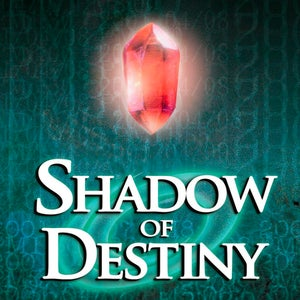

**Shadow of Destiny :diamonds: Achievement guide**
=======================================

This guide explains how to unlock each achievement in the core set for the PSP version of Shadow of Destiny.
If the explanation here doesn't suffice feel free to search up some guides, here are a few helpful resources:

+ [Fandom Wiki - Shadow of Memories/Shadow of Destiny](https://shadowofmemories.fandom.com/wiki/Shadow_of_Memories_Wiki "Shadow of Memories/Shadow of Destiny - Fandom Wiki")
+ [Youtube Guides - Shadow of Memories/Shadow of Destiny](https://www.youtube.com/@shadowofmemorieswiki/videos "Shadow of Memories/Shadow of Destiny - Wiki Youtube account")
+ [FAQS, guides & walkthroughs - Shadow of Memories/Shadow of Destiny](https://gamefaqs.gamespot.com/pc/553882-shadow-of-destiny/faqs "FAQS, guides & walkthroughs - Shadow of Memories/Shadow of Destiny")

***

### General tips for unlocking the achievements in this set
+ Don't skip the cutscenes, this should only be a problem if you're replaying the game, since you can't skip if you haven't seen the cutscene yet.
+ Fast forwarding with emulator tools is allowed and should still trigger the achievements.

# Achievement guide :heavy_exclamation_mark: <b><u>SPOILERS AHEAD</u></b> :heavy_exclamation_mark:
    
*(Achievements are divided by category)*

### :gem: Story completion

| Title + <i>ID (dev info)</i> | Explanation & tips | Specific unlock criteria |
|----|---|---|
| :trophy: <b>Defied Fate</b> <i>a_PrologueComplete</i> | Any walkthrough/gameplay guide | / |
| :trophy: <b>Defied Fate... Again</b> <i>a_Chapter1Complete</i> | Any walkthrough/gameplay guide | / |
| :trophy: <b>Left in the Past</b> <i>a_Chapter2Complete</i> | Any walkthrough/gameplay guide | / |
| :trophy: <b>An Alchemist, a Jewel and a Homunculus</b> <i>a_Chapter3Complete</i> | Any walkthrough/gameplay guide | / |
| :trophy: <b>Pan-tastic Resilience</b> <i>a_Chapter4CompletePan</i> | - There's multiple chapters in the game where you could acquire the frying pan. It all revolves around using the ornamental egg with the barman.   - Once the frying pan is acquired head back to the present and use it before dying.   - [Youtube guide - Frying Pan](https://www.youtube.com/watch?v=0nY35mtvdHQ "Shadow of Destiny - Frying Pan")   - [Shadow of Destiny wiki: Frying Pan](https://shadowofmemories.fandom.com/wiki/Frying_Pan "Shadow of Destiny wiki - Frying Pan")| / || / |
| :trophy: <b>Through the Lens of Survival</b> <i>a_Chapter4CompleteSign</i> | 1. In chapter 4, after you've visited Eckart's ancestor Alfred Brum. Go to the Franssen's Photo Shop and take the loose hanging sign outside.   2. Go back to the present and use the sign before dying   - [Youtube guide - Franssen's Shop Sign](https://youtu.be/1lyX-I3FTvU "Shadow of Destiny - Franssen's Shop Sign")   - [Shadow of Destiny wiki - Photo Shop Sign](https://shadowofmemories.fandom.com/wiki/Photo_Shop_Sign "Shadow of Destiny wiki - Photo Shop Sign")| / |
| :trophy: <b>Ancient Elixir</b> <i>a_Chapter5Complete</i> | Any walkthrough/gameplay guide | / |
| :trophy: <b>Director's Cut: The Time of Reckoning</b> <i>a_Chapter6CompleteThriller</i> | Any walkthrough/gameplay guide | Don't skip the cutscenes when choosing what movie you'll make with Oleg |
| :trophy: <b>Director's Cut: Trip for Two</b> <i>a_Chapter6CompleteLove</i> | Any walkthrough/gameplay guide | Don't skip the cutscenes when choosing what movie you'll make with Oleg |
| :trophy: <b>A Friend's Repentance</b> <i>a_Chapter7Complete</i> | Any walkthrough/gameplay guide | / |
| :trophy: <b>The Whole Picture... Or is it?</b> <i>a_Chapter8Complete</i> | Any walkthrough/gameplay guide | / |
| :trophy: <b>Complete the Epilogue</b> <i>a_EpilogueComplete</i> | Any walkthrough/gameplay guide | / |
| :trophy: <b>Complete the EX chapter</b> <i>a_EXChapterComplete</i> | Any walkthrough/gameplay guide | / |
| :trophy: <b>_title_</b> <i>_a_templateID_</i> | _explanation_ | _unlockCriteria_ |

### :gem: Branching paths
| Title + ID (dev info) | Explanation & tips | Specific unlock criteria |
|----|---|---|
| :trophy: <b>A Performer's Clue</b> <i>a_GetOrnamentalEgg</i> | 1. In chapter 1, talk to the kid and chose not to save his grandpa.   2. Then go back to the Marktplatz and interact with the performer dressed in white | / |
| :trophy: <b>A Jovial Exchange I</b> <i>a_EggCollection1</i> | - Prerequisite achievement => a_GetOrnamentalEgg   1. In chapter 1, head into the burning bar.   2. Time travel to the past   3. Interact with the fortune teller   4. Go back to the present, Back in the burning bar, interact with the stairs, the door and walk around the bar   5. Go back to the past, this time you spawn inside the bar, if not repeat from step 4 without resetting/reloading the game.   6. Now go downstairs twice. The second time you go down and if you have the ornamental egg, you will unlock this achievement. | / |
| :trophy: <b>A Jovial Exchange II</b> <i>a_EggCollection2</i> | - Prerequisite achievement => a_GetOrnamentalEgg   - In chapter 3 or 4 go to the bar and head downstairs with the ornamentel egg in your inventory| / |
| :trophy: <b>'Even I can do that'</b> <i>a_BecomeThePerformer</i> | - In chapter 4, when you haven't gotten the ornamentel egg (see a_GetOrnamentalEgg), there's only 2 ways to complete the chpater. By using Franssen's Shop Sign or becoming the performer   1. Go to 1908 and when you have the costume you will travel back to chapter 1   2. Use your jugglery item at the Marktzplatz, just as you've seen in the chapter 1 ending cutscene | / |
| :trophy: <b>_title_</b> <i>_a_templateID_</i> | _explanation_ | _unlockCriteria_ |

### :gem: Endings
| Title + ID (dev info) | Explanation & tips | Specific unlock criteria |
|----|---|---|
| :trophy: <b>An End to a Strange Experience</b>   <i>a_EndingA</i> | 1. In chapter 5, tell Margarette she's your ancestress   2. In chapter 8, after you've met Hugo at the Marktplatz, visit the fortune teller in the present AND find Homonculus in 1980's near Haupstreet, he's sitting next to a tree in a small park   3. Head back to Hugo in the present   4. In the Epilogue, chose for Margarette to stay in the present | / |
| :trophy: <b>No Sense of Finality I</b>   <i>a_EndingB1</i> | 1. In chapter 5, tell Margarette she's your ancestress.   2. In chapter 8, after you've met Hugo at the Marktplatz, go to the fortune teller   3. Head back to Hugo | / |
| :trophy: <b>No Sense of Finality II</b>   <i>a_EndingB2</i> | 1. In chapter 5, tell Margarette she's your ancestress.   2. In chapter 8, after you've met Hugo at the Marktplatz, time travel 1980's and find Homonculus near Haupstreet, he's sitting next to a tree in a small park.   3. Head back to Hugo in the present | / |
| :trophy: <b>'If only... I had one more attempt'</b>   <i>a_EndingC</i> | 1. In chapter 5, tell Margarette she's your ancestress.   2. In chapter 8, after you've met Hugo at the Marktplatz, go to The Middle Ages and head back to the alchemist's laboratory   3. Head back to the present | / |
| :trophy: <b>Eike's Origins</b>   <i>a_EndingD</i> | 1. In chapter 5, tell Margarette she's NOT your ancestress   2. In chapter 8, in The Middle Ages, leave Dana in the past   3. Head back the Marktplatz in the present | / |
| :trophy: <b>'The future is what we make it.'</b> <i>a_EndingE</i> | 1. In chapter 5, tell Margarette she's NOT your ancestress   2. In chapter 8, in The Middle Ages, ask Dana to return back to the present with you   3. Before going any further in the chapter, head back to the present and find a note at the door of Cafe Sonne   4. Go back to The Middle Ages, interact with Dana left of the town hall and head back to the present with her   5. Complete the rest of the game | / |

### :gem: Side content & extra cutscenes
| Title + ID (dev info) | Explanation & tips | Specific unlock criteria |
|----|---|---|
| :trophy: <b>Cracking Open the Past: Middle Ages</b> <i>a_IntroduceEggCollecting</i> | - Prerequisite achievement => a_GetOrnamentalEgg   - Stand near the town planter and use the ornamental egg on him during chapter 2   - You can find him in 1580 in the Marktplatz after you visit Margarette's house | / |
| :trophy: <b>Cracking Open the Past: The Old Century</b> <i>a_IntroduceEggCollecting2</i> | 1. In chapter 6, acquire the pocket watch shaped like an egg by Oleg   2. Go to 1902 and meet the barman's ancestor at his bar | / |
| :trophy: <b>The Barman's Grandchildren and The Mystery Child</b> <i>a_BarmansChildren</i> | In chapter 5, after your initial death, head back into the bar and have 2 conversations with the barman | / |
| :trophy: <b>A Hatchless Replica</b> <i>a_PocketWatchCollection</i> | In chapter 7, after you have found the towerdoor key. Go back to the present (not 'night before') and go back to the bar whilst you have the egg shaped pocket watch still in your inventory | / |
| :trophy: <b>The Eggcellent Director's Tale</b> <i>a_PocketWatchReminiscing</i> | In chapter 8, go back to Eckart in his office, whilst you have the egg shaped pocket watch still in your inventory | / |
| :trophy: <b>The Pyromancer's Legacy</b> <i>a_EikeThePyromancer</i> |  1. In chapter 2, use the <u>lighter</u> to scare away the crowd in 1580   2. When talking to the townplanter chose to build a statue   3. Finish the chapter   - [Youtube guide - Scenes statue or flowers](https://www.youtube.com/watch?v=DeA72VF3NP8 "Shadow of Destiny - Scenes statue or flowers") | *Triggered achievement2*   - This trigger disables when you pick flowers |
| :trophy: <b>The Magician's Legacy</b> <i>a_EikeTheMagician</i> | 1. In chapter 2, use the <u>cellphone</u> to scare away the crowd in 1580   2. When talking to the townplanter chose to build a statue   3. Finish the chapter   - [Youtube guide - Scenes statue or flowers](https://www.youtube.com/watch?v=DeA72VF3NP8 "Shadow of Destiny - Scenes statue or flowers") | *Triggered achievement2*   - This trigger disables when you pick flowers |
| :trophy: <b>A Blossoming Plan</b> <i>a_EikeTheFlorist</i> | 1. In chapter 2, when talking to the townplanter with the squire's crest, chose to plant flowers   2. Finish the chapter   - [Youtube guide - Scenes statue or flowers](https://www.youtube.com/watch?v=DeA72VF3NP8 "Shadow of Destiny - Scenes statue or flowers") | *Triggered achievement2* |
| :trophy: <b>Complexities of the Fourth Dimension</b> <i>a_DoctorateTimeTraveling</i> | Complete chapter 4 whilst also taking the picture yourself in the same chapter.   1. Meet Alfred & Sibylla Brum   2. Go and find an iron plate (view a_Chapter4CompletePan or a_Chapter4CompleteSign)   3. Don't go back to the present immediately once you acquire them, but head back to Sibylla. Now you'll take the family picture.   4. Complete the chapter, you should now get an extended ending cutscene for this chapter | / |
| :trophy: <b>Strokes of Destiny</b> <i>a_ArtAppreciator</i> | - Interact with all 8 paintings in the Brum Museum   - You can find 7/8 on the second floor, where your first meet Eckart. 1 painting is on the first/ground floor   - [Youtube guide - Art Museum](https://www.youtube.com/watch?v=U5hXY6pxJ9M "Lebensbaum Tours - The Brum Art Museum") | *Measured achievement1*  |
| :trophy: <b>Timeless Antiques</b> <i>a_AntiquesEule</i> | - Visit Antique Shop Eule and view the relics   - It's open during in chapter 3-4 (2001) and 6-7 (1980)| *Measured achievement1*  |
| :trophy: <b>Enigmatic Couple I: Prelude</b> <i>a_EnigmaticCouple1</i> | - Talk to both the coated man and woman multiple times to progress the dialogue  - You must find them during the prologue (present) or chapter 1 (past)   - [Youtube guide - Lost Young Couple Sidequest Guide PSP](https://www.youtube.com/watch?v=zL96i0QQLME "Shadow of Destiny / Memories - Lost Young Couple Sidequest Guide PSP") | *Measured achievement1*  |
| :trophy: <b>Enigmatic Couple II: Shadowing or Lost?</b> <i>a_EnigmaticCouple2</i> | - Talk to both the coated man and woman multiple times to progress the dialogue  - You must find them during chapter 3 (present)   - [Youtube guide - Lost Young Couple Sidequest Guide PSP](https://www.youtube.com/watch?v=zL96i0QQLME "Shadow of Destiny / Memories - Lost Young Couple Sidequest Guide PSP") | *Measured achievement1*  |
| :trophy: <b>Enigmatic Couple III: Wandering Once More</b> <i>a_EnigmaticCouple3</i> | - Talk to both the coated man and woman multiple times to progress the dialogue  - You must find them during chapter 4 (present)   - [Youtube guide - Lost Young Couple Sidequest Guide PSP](https://www.youtube.com/watch?v=zL96i0QQLME "Shadow of Destiny / Memories - Lost Young Couple Sidequest Guide PSP") | *Measured achievement1*  |
| :trophy: <b>Enigmatic Couple IV: Origins</b> <i>a_EnigmaticCouple4</i> | - Talk to both the coated man twice and the woman once   - You must find them during chapter 5 (present)   - [Youtube guide - Lost Young Couple Sidequest Guide PSP](https://www.youtube.com/watch?v=zL96i0QQLME "Shadow of Destiny / Memories - Lost Young Couple Sidequest Guide PSP") | *Measured achievement1*  |
| :trophy: <b>Enigmatic Couple V: Epilogue</b> <i>a_EnigmaticCouple5</i> | - Talk to the coated man and woman   - You must find them during chapter 7 (Night before)   1. Acquire the towerkey   2. Return to the present (not 'night before')   3. Go outside and and find them around Lebensbaum   - If you find the key to the towerdoor, they will despawn   - [Youtube guide - Lost Young Couple Sidequest Guide PSP](https://www.youtube.com/watch?v=zL96i0QQLME "Shadow of Destiny / Memories - Lost Young Couple Sidequest Guide PSP") | *Measured achievement1*  |
| :trophy: <b>Yesteryears Couple I: Destined to Miss</b> <i>a_LostYoungCouple1</i> | - Find & interact with the lost man and woman in The Middle Ages during chapter 2  1. Talk to both once   2. Talk to both again (2nd time)   3. Go to Margarette's house (Alchemist's house)   4. Find & interact with both the man and woman again (3rd time)   - [Youtube guide - Lost Young Couple Sidequest Guide PSP](https://www.youtube.com/watch?v=zL96i0QQLME "Shadow of Destiny / Memories - Lost Young Couple Sidequest Guide PSP") | *Measured achievement1*  |
| :trophy: <b>Yesteryears Couple II: The Place Where We Nigh Met</b> <i>a_LostYoungCouple2</i> | - Prerequisite (maybe): "a_LostYoungCouple1"   - Find & interact with the lost man and woman in in The Middle Ages during chapter 3  1. Talk to both once   2. Talk to both again (2nd time)   3. Go to Margarette's house (Alchemist's house)   4. Find & interact with both the man and woman again (3rd time)   - [Youtube guide - Lost Young Couple Sidequest Guide PSP](https://www.youtube.com/watch?v=zL96i0QQLME "Shadow of Destiny / Memories - Lost Young Couple Sidequest Guide PSP")| *Measured achievement1*  |
| :trophy: <b>Yesteryears Couple III: Destiny's Promise Fulfilled</b> <i>a_LostYoungCouple3</i> | - Prerequisite (maybe): "a_LostYoungCouple2"   - Find & interact with the lost man and woman in The Middle Ages during chapter 4  1. Talk to both once   2. Talk to both again (2nd time)   3. Go to Margarette's house (Alchemist's house)   4. Find & interact with both the man and woman again (3rd time)   - [Youtube guide - Lost Young Couple Sidequest Guide PSP](https://www.youtube.com/watch?v=zL96i0QQLME "Shadow of Destiny / Memories - Lost Young Couple Sidequest Guide PSP") | *Measured achievement1*   |
| :trophy: <b>Yesteryears Couple IV: Parting</b> <i>a_LostYoungCouple4</i> | - Prerequisite (maybe): "a_LostYoungCouple3"   - Find & interact with the young man in The Middle Ages during chapter 5  - Talk to him twice   - [Youtube guide - Lost Young Couple Sidequest Guide PSP](https://www.youtube.com/watch?v=zL96i0QQLME "Shadow of Destiny / Memories - Lost Young Couple Sidequest Guide PSP") | *Measured achievement1* |
| :trophy: <b>Yesteryears Couple V: Man-in-waiting</b> <i>a_LostYoungCouple5</i> | - Prerequisite (High likely): "a_LostYoungCouple4"   - Find & interact with the young man and woman in The Middle Ages during chapter 7   - Talk to the woman, advise her to tell the truth. This dialogue option might not show if you haven't talked to them in previous chapters during the current playthrough. Also talk to the man once.   - [Youtube guide - Lost Young Couple Sidequest Guide PSP](https://www.youtube.com/watch?v=zL96i0QQLME "Shadow of Destiny / Memories - Lost Young Couple Sidequest Guide PSP") | *Measured achievement1* |
| :trophy: <b>Yesteryears Couple VI: Never Destined to Meet</b> <i>a_LostYoungCouple6</i> | - Prerequisite (high likely): "a_LostYoungCouple5"   - Find & interact with the young man in The Middle Ages during chapter 8   - Talk to the man before AND after the experiment. On dialogue option, choose: Lover are never destined to meet. This dialogue option might not show if you haven't talked to them in previous chapters during the current    - [Youtube guide - Lost Young Couple Sidequest Guide PSP](https://www.youtube.com/watch?v=zL96i0QQLME "Shadow of Destiny / Memories - Lost Young Couple Sidequest Guide PSP") | *Measured achievement1* |
| :trophy: <b>Nine lives across generations</b> <i>a_TimeTravellingCat</i> | 1. Take the picture in 1908 dressed in the white costume (this must be done in chapter 4 or 5)   2. Talk to Sibylla again   3. Talk to Eckart in the present, to receive a kitten (this must be done before chapter 7)   4. Give the kitten to Sibylla in 1908 (in chapters 4 to 8) | / |
| :trophy: <b>A Mother's Child Forever</b> <i>a_HugoMotherChild</i> | 1. In chapter 5, go to 1584 and find the key inside the alchemist's house   2. time travel to 1580 and head to the Martkzplatz to view a secret cutscene   - [Youtube - Secret cutscene: Hugo bullied](https://www.youtube.com/watch?v=wvgHnCbaS6A "Shadow of Destiny - Secret cutscene: Hugo bullied") | / |
| :trophy: <b>'Picked up a baby the other day'</b> <i>a_SnowyCrimeScene</i> | - In chapter 6, after speaking to Oleg, head straight to Hauptstreet.   There's 3 cutscenes, each one activating the closer you get to Haupstreet | / |
| :trophy: <b>Illusive Guardian of the Brums</b> <i>a_SaveMiriamBrum</i> | - Make sure you have a few energy units stored to complete this achievement   1. In chapter 6, while talking to Oleg pick the right choices which will result in a box office movie hit in the present (refer to a_Chapter6CompleteThriller or a_Chapter6CompleteLove).   2. Go to Haupstreet (refer to a_SnowyCrimeScene) and view all 3 cutscenes.   3. At the end of the cutscene where Miriam dies, time travel back to the same time period (1980, the snowy day), but this time you'll arrive just before the shooting takes place   4. Pick any choice while talking to Miriam   5. Walk around Haupstreet again, to view an altered cutscene of Miriam's death.   6. Once the cutscene finishes, travel back to the present   7. Once back in the present, immediately travel back to 1980, the snowy day   8. After talking to Miriam again, chase her around Lebensbaum, if you're too slow to follow her you may have to restart this step   9. After saving Miriam, talk to Brum couple twice to receive the achievement   - [Youtube Guide - Saving Miriam Brum](https://www.youtube.com/watch?v=dYZQhdKD_hY "Shadow of Memories/Destiny - Saving Miriam Brum") | / |
| :trophy: <b>The Brum's Happily Ever After</b> <i>a_MeetOldMiriam</i> | Complete Chapter 7, whilst having saved Miriam Brum in chapter 6 (refer to a_SaveMiriamBrum & a_SnowyCrimeScene)   Achievement unlocks once Miriam Brum is done talking during the last cutscene of chapter 7| / |
| :trophy: <b>Energy Amasser: Present Day</b> <i>a_EnergyOrbLocatorPresentDay</i> | 1. Make sure there's enough space to pick up 5 energy orbs/units in 1 go without using the digipad/z-pad. So in other words have 5 empty slots to pickup the required energy orbs.   2. Pick up all the energy orbs in the city during the present day, 2001.   - Count will reset when using the digipad or when finishing a chapter.   - [GameFAQs guide containing locations of energy orbs (E.U.'s)](https://gamefaqs.gamespot.com/psp/977639-shadow-of-destiny/faqs/14255 "Shadow of Memories/Destiny - GameFAQs guide by Oreo") | *Measured achievement1* |
| :trophy: <b>Energy Amasser: Middle Ages</b> <i>a_EnergyOrbLocatorMiddleAges</i> | 1. Make sure there's enough space to pick up 6 energy orbs/units in 1 go without using the digipad/z-pad. So in other words have 6 empty slots to pickup the required energy orbs.   2. Pick up all the energy orbs in the city during the Middle Ages, 1580-1584.   - This time period has 7 different energy orb locations, but you can only acquire 6 of them in one chapter   - Might only be possible from chapter 6 onward   - Count will reset when using the digipad or when finishing a chapter.   - [GameFAQs guide containing locations of energy orbs (E.U.'s)](https://gamefaqs.gamespot.com/psp/977639-shadow-of-destiny/faqs/14255 "Shadow of Memories/Destiny - GameFAQs guide by Oreo") | *Measured achievement1* |
| :trophy: <b>Energy Amasser: 70's - 80's</b> <i>a_EnergyOrbLocator70s80s</i> | 1. Make sure there's enough space to pick up 5 energy orbs/units in 1 go without using the digipad/z-pad. So in other words have 5 empty slots to pickup the required energy orbs.   2. Pick up all the energy orbs in the city in 1979-1980.   - Count will reset when using the digipad or when finishing a chapter.   - [GameFAQs guide containing locations of energy orbs (E.U.'s)](https://gamefaqs.gamespot.com/psp/977639-shadow-of-destiny/faqs/14255 "Shadow of Memories/Destiny - GameFAQs guide by Oreo") | *Measured achievement1* |
| :trophy: <b>Energy Amasser: The Old Century</b> <i>a_EnergyOrbLocator1900Days</i> | 1. Make sure there's enough space to pick up 5 energy orbs/units in 1 go without using the digipad/z-pad. So in other words have 5 empty slots to pickup the required energy orbs.   2. Pick up all the energy orbs in the city in the 1900's.   - Count will reset when using the digipad or when finishing a chapter.   - [GameFAQs guide containing locations of energy orbs (E.U.'s)](https://gamefaqs.gamespot.com/psp/977639-shadow-of-destiny/faqs/14255 "Shadow of Memories/Destiny - GameFAQs guide by Oreo") | *Measured achievement1* |
| :trophy: <b>Time-Spun Sweets</b> <i>a_GiveMargaretteCake</i> | 1. Acquire a cake sample from the bakery in chapter 3 or 6   2. Give the cake to Margarette in the Middle Ages, possible from chapter 5 onward | / |
| :trophy: <b>a_NewCakeInvented</b> <i>Legacy of Sweetness</i> | 1. 1. Acquire a cake sample from the bakery in chapter 3 or 6   2. Give the cake to Margarette in the Middle Ages, possible from chapter 5 onward   3. Return to the bakery girl in chapter 6 in 1980   4. Gift the second sample to Margarette as well | / |
| :trophy: <b>Stockpiling Across Eras</b> <i>a_MaxInventory</i> | - Collect an old map, obtainable from city hall: before chapter 3, you'll find it inside. After chapter 3 it will be just outside next to the door   - Collect the ornamental egg in chapter 1   - Collect a cake sample in chapter 3   - Collect a scrap of meat from the butcher from chapter 4 onward, in 1902 or 1582    - Collect Franssen's Photo shop sign in chapter 4   -  Collect the kitten in chapter 4 or 5   - Collect a letter to Dana: Go for ending E, after acquiring the red stone from Dana, don't go to Dr. Wagner  but head to Café Sonne and collect the letter    - Collect other key items along the way   - Biggest inventory achieved at 21 items (including the 5 starter items) | / |
| :trophy: <b>_title_</b> <i>_a_templateID_</i> | _explanation_ | _unlockCriteria_ |

### :gem: Hidden cutscenes that lead to death
| Title + ID (dev info) | Explanation & tips | Specific unlock criteria |
|----|---|---|
| :trophy: <b>Met me before</b> <i>a_MetYouBefore</i> | Die 4 times to the tree killer while speaking to Dana in chapter 2 | / |
| :trophy: <b>'That's a big no no'</b> <i>a_ErasingEike</i> | Talk to yourself at cafe Sonné in the past during the prologue | / |
| :trophy: <b>Bump... Erased</b> <i>a_ErasingEike2</i> | 1. In chapter 7, after interacting with the tower door, the night before, timetravel back to 1902   2. Interact with the front door of the Brum Mansion | / |
| :trophy: <b>Fated to Plunge</b> <i>a_RottenRope</i> | In chapter 7, try to save yourself with an old rope. It can be found in the tower.   You have to attach the rope the night before and then interact with it in the present. | / |
| :trophy: <b>'My my, so eager to die'</b> <i>a_ExcuseMeMyMy</i> | In chapter 3, when meeting Homonculus for the first time at the Brum Musuem, chose to excuse yourself | / |
| :trophy: <b>Time Ego Flop</b> <i>a_TimeEgoFlop</i> | - In chapter 6, talk to Oleg in 1980   1. Pick time travel   2. Pick world conquest   3. Return to present | / |
| :trophy: <b>_title_</b> <i>_a_templateID_</i> | _explanation_ | _unlockCriteria_ |

## Footnotes
#### *Measured achievement1*
+ Once the measured achievement popup is shown, complete the rest of the achievement in the same session, otherwise you may have to restart the chapter. 
#### *Triggered achievement2*
+ Once the triggered achievement popup is shown, complete the achievement in the same session, otherwise you may have to restart the chapter. 
